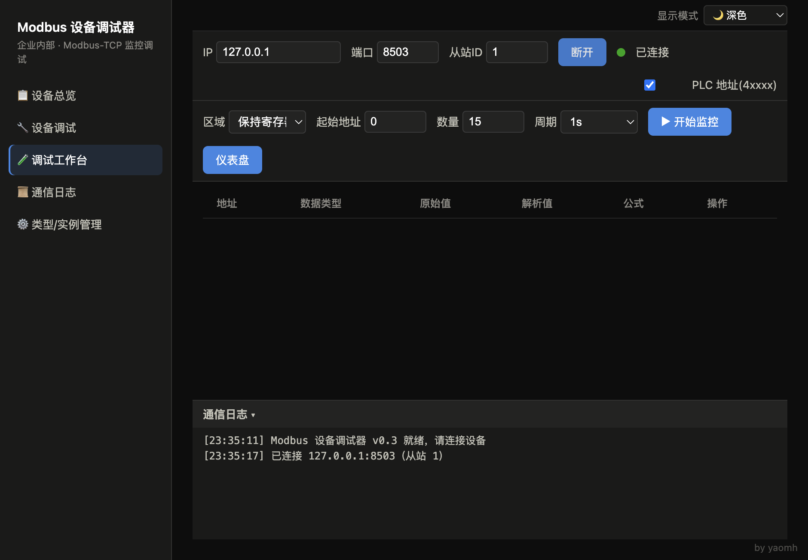
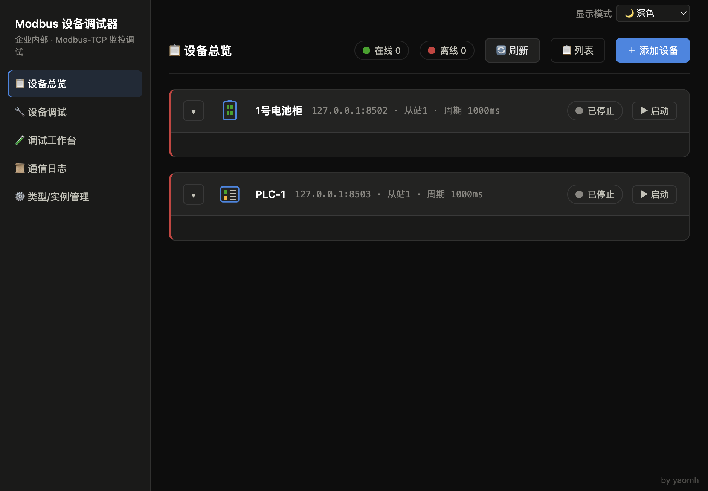

# ModbusMate 使用手册

> **一句话介绍**：ModbusMate 是一款 Modbus-TCP 通信调试工具，帮你在电脑上读取和写入工业设备的数据，比如 PLC、温控器、电表、变频器等。

---

## 目录

1. [软件简介](#一软件简介)
2. [快速上手](#二快速上手)
3. [界面分区介绍](#三界面分区介绍)
4. [连接真实设备](#四连接真实设备)
5. [数据监控](#五数据监控)
6. [数据写入](#六数据写入)
7. [公式换算](#七公式换算)
8. [设备模板管理](#八设备模板管理)
9. [设备管理](#九设备管理)
10. [设备总览与仪表盘](#十设备总览与仪表盘)
11. [内置模拟器](#十一内置模拟器)
12. [常见问题](#十二常见问题)
13. [主题切换](#十三主题切换)
14. [联系方式与反馈](#十四联系方式与反馈)

---

## 一、软件简介

ModbusMate 是一个专门给现场工程师和调试人员用的 Modbus-TCP 通信调试工具。你不需要懂复杂的通信协议，只要输入设备的 IP 地址，就能在电脑上看到设备里的实时数据，也可以往设备里写值。

它能同时监控多台设备，每台设备的数据以卡片形式展示，一目了然。支持给原始数据套用公式换算成你熟悉的工程值（比如把数字 500 显示成 50% 电量），也支持一键切换深色/浅色主题。

> **开发阶段状态**：通信核心现已同时支持 **Modbus-TCP** 与 **Modbus-RTU**。RTU 串口参数支持 Windows `COM` 端口和 macOS `/dev/tty.*` 设备路径，串口枚举 IPC 也已完成。浏览器网页 UI 和现有页面的 RTU 表单将在下一阶段接入该核心；当前界面尚不能使用 RTU。

---

## 二、快速上手

跟着下面几步，从打开软件到看到数据，最快 10 秒钟。

### 2.1 安装软件

**Mac 电脑**：双击 `ModbusMate-xxx.dmg` 文件，把图标拖进"应用程序"文件夹。

**Windows 电脑**：双击 `ModbusMate Setup xxx.exe`，按提示完成安装。也可以直接双击 `ModbusMate xxx.exe`（免安装版）。

### 2.2 用内置模拟器体验（推荐第一次使用）

> ⚠️ 重要：模拟器必须**先启动**，ModbusMate 才能读到数据！启动后模拟器会持续运行，不要关闭那个终端窗口。

软件自带多个虚拟设备，不需要连接真实设备就能看到效果：

**第一步：启动模拟器（以下二选一）**

模拟电池柜（推荐，数据会动态变化）：
```bash
npm run sim:bat    # 监听 8502 端口
```

模拟 PLC 控制器：
```bash
npm run sim:plc    # 监听 8503 端口
```

两个模拟器可以同时启动（各开一个终端窗口）。

**第二步：在 ModbusMate 中连接查看**

1. 回到 ModbusMate，点击左侧导航的 **「🧪 调试工作台」**
2. 在连接栏输入 IP：`127.0.0.1`，端口：`8502`，从站 ID：`1`
3. 点击 **「连接」** 按钮，状态灯变绿就成功了
4. 在监控配置里选"保持寄存器"，起始地址填 `0`，数量填 `10`
5. 点击 **「开始监控」**，表格里就会出现实时数据

### 2.3 最小要求

- **Mac**：macOS 10.12 及以上
- **Windows**：Windows 7 及以上
- **网络**：电脑和设备需要在同一个网络里（连着同一个路由器就行）

---

## 三、界面分区介绍

打开软件后，你会看到下面这些区域：

### 左侧导航栏（5 个页面）

| 图标 | 页面名称 | 有什么用 |
|------|----------|----------|
| 📋 | **设备总览** | 所有已启动设备的仪表盘，大数字卡片一目了然 |
| 🔧 | **设备调试** | 查看某台设备各个数据点的明细数值 |
| 🧪 | **调试工作台** | 老版本的单设备模式，连接一台设备看数据 |
| 📜 | **通信日志** | 所有设备的通信记录，排查问题用 |
| ⚙️ | **类型/实例管理** | 创建设备模板、添加设备实例的地方 |

### 右上角

- **主题切换菜单**：切换深色/浅色/跟随系统
- **PLC 地址勾选框**：切换地址显示方式（一般不用动）

### 右下角

- 开发者署名信息



---

## 四、连接真实设备

### 4.1 需要准备三个信息

要从真实设备读取数据，你需要知道三样东西：

1. **IP 地址**：设备的网络地址，像 `192.168.1.100` 这样。不知道的话问设备管理员，或在设备屏幕上找网络设置。
2. **端口号**：Modbus-TCP 通信的端口，绝大多数设备默认是 `502`，一般不用改。
3. **从站 ID**：设备的编号，大多数设备默认是 `1`。如果一条总线上挂了多台设备，它们会有不同的编号。

### 4.2 连接步骤

1. 在连接栏输入设备的 IP 地址
2. 端口填 `502`（默认，一般不用改）
3. 从站 ID 填 `1`（默认，一般不用改）
4. 点击 **「连接」** 按钮
5. 状态灯变绿色 → 连接成功；变红色 → 没连上

### 4.3 连不上怎么办

| 现象 | 可能的原因 |
|------|------------|
| 显示"拒绝连接" | 设备没开 Modbus-TCP 服务，或者端口号不对 |
| 显示"无响应" | 网线松了、设备没开机、IP 不对 |
| 显示"找不到主机" | IP 地址填错了 |

---

## 五、数据监控

连接成功后，就可以开始看设备里的数据了。

### 5.1 设置监控参数

1. **区域**：选择要读什么类型的数据
   - **保持寄存器**：可读可写，最常用（如设置值、运行参数）
   - **输入寄存器**：只能读不能写（如传感器采集值）
   - **线圈**：开/关信号，可读可写
   - **离散输入**：开/关信号，只能读
2. **起始地址**：从第几个位置开始读
3. **数量**：一次读多少个数据（最多 120 个）
4. **周期**：多久刷新一次数据（100ms 最快，10s 最慢）
5. 点击 **「开始监控」**，表格里就会显示出实时数据

### 5.2 怎么看表格

表格每一行显示一个数据点：

- **地址**：数据在设备中的位置编号
- **原始值**：设备返回的原始十六进制数值（一般不用关心）
- **解析值**：转换后的可读数值（这才是你关心的）
- **公式**：显示有没有套用换算公式
- **写入**：点击可往这个地址写值

如果某个数值发生了变化，这一行会**闪烁黄色**提醒你。

---

## 六、数据写入

除了看数据，你还可以往设备里写值。

### 6.1 写入步骤

1. 在数据表格里找到你要修改的那一行
2. 点击右侧的 **「写入」** 按钮
3. 在弹出的窗口中输入你要写的值
4. 点击 **「写入」** 确认

### 6.2 注意事项

- **保持寄存器**和**线圈**才能写入，**输入寄存器**和**离散输入**是只读的，没有写入按钮
- 写入线圈时，输入 `1` 表示开（ON），输入 `0` 表示关（OFF）
- 如果输错了范围（比如给一个只能存 0~100 的位置写了 500），软件会提示你
- 写入成功后，下一个刷新周期会自动读回新值确认

---

## 七、公式换算

设备里存的数据经常不是直接能看懂的。比如一个温度传感器，它存的原始数值是 2048，实际温度应该是 41.9℃。这就需要用到公式换算。

### 7.1 公式长什么样

```
显示值 = k × 原始值 + b
```

- **k**（系数）：乘数
- **b**（偏移）：加数

### 7.2 怎么设置

1. 在数据表格中，点击某一行公式列的 **「设置」** 按钮
2. 在弹出的窗口中填写：
   - **名称**：给这个数据起个名字，如"电池温度"
   - **单位**：工程单位，如 `℃`、`%`、`A`、`V`
   - **系数 k**：换算公式的乘数
   - **偏移 b**：换算公式的加数
   - **小数位**：保留几位小数（留空自动）

### 7.3 举个栗子

| 场景 | 原始值范围 | 公式 | 显示效果 |
|------|-----------|------|----------|
| 电池电量 0~1000 → 0~100% | 原始值 500 | k=0.1, b=0 | 显示 **50%** |
| 温度传感器 0~4095 → -40~125℃ | 原始值 2048 | k=0.04, b=-40 | 显示 **41.9℃** |
| 电流变送器 0~2000 → 0~200A | 原始值 1500 | k=0.1, b=0 | 显示 **150.0A** |

设置好公式后，表格的"解析值"列就会直接显示换算后的工程值，不用你每次心算了。

---

## 八、设备模板管理

当你有多台同类型的设备时（比如 10 个一样的电表），可以创建一个"设备模板"，一次配好，反复使用。

### 8.1 创建模板

1. 点击左侧导航的 **「⚙️ 类型/实例管理」**
2. 点击 **「＋ 新建类型」** 按钮
3. 填写模板名称，比如"智能电表"
4. 添加点位（就是你要看的数据点）：
   - **名称**：数据点名字，比如"电压"、"电流"
   - **区域**：选择"保持寄存器"或"输入寄存器"等
   - **地址**：数据在设备里的位置编号
   - **类型**：选"UInt16"通常就够了
   - **k / b**：如果需要公式换算就填，不需要就留空
   - **单位**：比如 V、A、℃
5. 点击保存

### 8.2 点位字段说明

| 字段 | 说明 | 示例 |
|------|------|------|
| 名称 | 数据点的中文名称 | `电池电压` |
| 区域 | 数据在设备的哪个功能区 | 保持寄存器 |
| 地址 | 数据的起始位置（从 0 开始） | `0` |
| 类型 | 数据的格式 | UInt16、Int32、Float32 等 |
| k / b | 公式换算的系数和偏移 | k=0.1, b=0 |
| 单位 | 工程单位 | V、A、℃、% |



---

## 九、设备管理

有了模板之后，就可以添加具体的设备实例了。

### 9.1 添加设备实例

1. 在 **「⚙️ 类型/实例管理」** 页面，点击 **「＋ 添加设备」**
2. 填写：
   - **实例名称**：给你的设备起个名字，比如"1号电表"
   - **选择类型**：选之前创建好的模板
   - **IP 地址**：这台设备的 IP
   - **端口**：一般填 502
   - **从站 ID**：一般填 1
   - **采集周期**：多久读一次数据
3. 点击保存

### 9.2 启动/停止/删除

- **启动**：点击设备旁的 **「启动」** 按钮，软件会自动连接这台设备并开始采集数据
- **停止**：点击 **「停止」** 断开连接
- **删除**：需要先停止设备，才能删除

### 9.3 状态灯怎么看

| 灯色 | 含义 |
|------|------|
| 🟢 绿色 | 已连接，正常工作 |
| ⚪ 灰色 | 未启动 |
| 🔴 红色 | 离线或连接失败 |
| 🟡 黄色 | 正在重连 |

---

## 十、设备总览与仪表盘

当你启动了一台或多台设备后，可以到 **「📋 设备总览」** 页面查看它们的实时数据。


### 10.1 怎么看设备总览

每台已启动的设备会显示为一个分组：

- **组头**：设备状态灯 + 设备名称 + IP 地址 + 在线/离线标签
- **组体**：该设备所有数据点的大数字卡片

### 10.2 卡片和列表切换

你可以点击 **「卡片」** 或 **「列表」** 按钮切换显示方式：
- **卡片模式**：大号数字，一目了然，适合远距离查看
- **列表模式**：更紧凑，适合同时看多个数据点

### 10.3 折叠和展开

每个设备分组可以点击折叠/展开，方便你只关注某台设备。

### 10.4 数值变化提醒

卡片上的数值发生变化时，卡片会**黄色闪烁**一下，让你第一时间知道数据变了。

如果设备的单位是 `%` 并且数值在 0~100 之间，卡片上还会显示一个**进度条**，更直观。

### 10.5 设备离线

如果设备断开了，分组会变成半透明状态，状态灯变红。设备重新连上后会自动恢复。

---

## 十一、内置模拟器

如果你手头没有真实设备，又想体验一下 ModbusMate 的功能，可以用内置的模拟器。模拟器会在你的电脑上"假装"成一个真实设备。

### 11.1 启动模拟器

> 模拟器是独立的命令行程序，需要**先启动并保持运行**，ModbusMate 才能连上去读取数据。

打开终端（Mac 的"终端"或 Windows 的"命令提示符"），进入软件目录，按需选择下面的命令：

**模拟电池柜**（推荐第一个试这个）：
```bash
npm run sim:bat
```
这个模拟器会产生电压、电流、温度等动态变化的数据，效果最真实。

**模拟 PLC 控制器**：
```bash
npm run sim:plc
```

**模拟温控器**：
```bash
npm run sim:temp
```

**同时启动三个模拟器**：
```bash
npm run sim:all
```

### 11.2 连接到模拟器

启动模拟器后，在 ModbusMate 中：
1. 左侧导航点 **「🧪 调试工作台」**
2. IP 填 `127.0.0.1`（这是本机地址）
3. 端口根据模拟器提示填（电池柜是 8502，PLC 是 8503，温控器是 8504）
4. 从站 ID 填 `1`
5. 点击连接 → 开始监控 → 数据就出来了

### 11.3 三个模拟器各自的特点

| 模拟器 | 端口 | 有什么数据 | 数据特点 |
|--------|------|-----------|----------|
| 电池柜 | 8502 | 电压、电流、温度、电量百分比 | 电压会像真实电池一样慢慢下降 |
| PLC 控制器 | 8503 | 速度、良品数、温度、运行时长 | 良品数不断增加，像真实生产线 |
| 温控器 | 8504 | 温度、湿度、目标温度 | 温度会朝目标值慢慢靠近 |

---

## 十二、常见问题

### Q1: 连接不上设备，怎么办？

按顺序检查这几项：
1. 试试在电脑上用 `ping 设备IP` 命令（比如 `ping 192.168.1.100`），看通不通
2. 检查网线有没有插好
3. 确认设备电源是否打开
4. 确认设备支持 Modbus-TCP 协议（有些设备只能用串口）
5. 检查端口号是不是 502（有些设备可能用其他端口）
6. 检查从站 ID 是否和设备设置一致

### Q2: 读出来的数值明显不对？

1. 检查数据类型选对了没有（整数还是小数）
2. 如果数据是两种格式的，尝试切换一下字序（AB/BA）
3. 检查起始地址是不是对的（有时候地址从 0 开始，有时候从 1 开始）

### Q3: 提示"缺下一寄存器"是什么意思？

你把某个数据设成了占用两个位置的类型（比如 32 位浮点数），但读取数量不够，导致第二个位置没数据。解决方法是把读取数量加大一点。

### Q4: 写入失败怎么办？

1. 确认你写的是可读可写的区域（保持寄存器或线圈）
2. 输入寄存器（只读）和离散输入（只读）不支持写入
3. 检查你写的值是不是在合理范围内
4. 看日志栏有没有具体的错误提示

### Q5: 软件重启后，之前的配置不见了？

配置保存在电脑的 `config.json` 文件中。如果这个文件损坏了，关闭软件后删除它，再重新打开软件就会自动生成新的。

### Q6: 设备离线后又自动连上了，我需要做什么？

什么都不用做！ModbusMate 有自动重连功能。设备断线后它会每隔 5 秒尝试一次重连，连上后自动继续采集数据。日志栏会提示"连接已恢复"。

---

## 十三、主题切换

ModbusMate 支持三种显示主题，在窗口右上角点击"显示模式"菜单切换：

| 主题 | 适合场景 |
|------|----------|
| **🌙 深色模式** | 默认主题，暗色背景，适合在控制室或光线较暗的环境使用 |
| **☀️ 浅色模式** | 白色背景，适合在光线充足的环境使用 |
| **💻 跟随系统** | 自动跟随你电脑的系统主题设置 |

选好后软件会自动记住你的偏好，下次打开还是你喜欢的主题。

---

## 十四、联系方式与反馈

ModbusMate 由 **yaomh** 开发和维护。

如果你在使用过程中遇到问题、有建议或想报告 Bug，欢迎通过以下方式联系：

📧 **邮箱**：yaomh592@gmail.com

欢迎提供反馈，我会持续改进这个工具！
